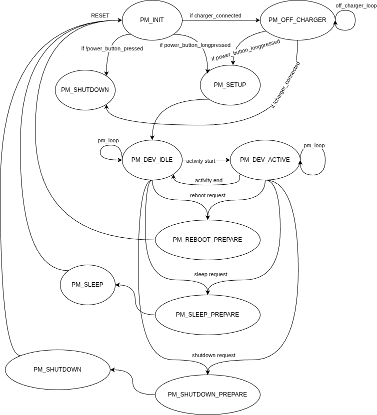

# Библиотека Power management для микроконтроллеров серии ESP32x

Библиотека Power management предназначена для управления общим состоянием устройства с точки зрения питания и пользовательского опыта.

Подходит для таких случаев, как:
- устройство запитано от розетки, но использует батарею для резервного питания
- устройство, запитанное от батареи, и рассчитано на нахождение в состоянии сна и периодическое просыпание
- устройство, запитанное от батареи и с графическим интерфейсом

# Как установить

Учтите, что библиотека для ESP-IDF (протестирована на v5.5.1) и не адаптирована для работы с Arduino.

Склонируйте репозиторий или скачайте проект в папку "components" Вашего проекта.

# Как использовать

Ниже дан скелет проекта с использованием Power management, файл main.c:
```
#include "power_management.h"   // библиотека Power management
#include "esp_event.h"          // Чтобы инициировать главный event loop
// ...
#include "driver/i2c_master.h"  // Интерфейс управления PMIC
#include "driver/gpio.h"        // Для опроса состояния кнопки
#include "esp_sleep.h"          // Вызовы для перевода МК в сон
#include "driver/rtc_io.h"      // Управление пинами RTC
#include "esp_system.h"         // Доступ к вызову esp_restart()
// ...

void on_setup() {
    // TODO: Действия для дополнительной проверки флага пробуждения и полная инициализация внешней периферии/устройства
}

void on_sleep() {
    // TODO: Действия, при которых происходить непосредственно усыпление устройства (включая вызов перевода МК в сон).
    // Например, вызов esp_deep_sleep_start();
    esp_deep_sleep_start();
}

void on_reboot() {
    // TODO: Действия, которые должны происходить непосредственно при перезагрузе, включая вызов esp_restart().
    esp_restart();
}

void on_shutdown() {
    // TODO: Действия для выключения устройства
    // включая команду PMIC на выключение (немедленное или отложенное)
    // и вызов esp_deep_sleep_start() на случай если PMIC не может отключить устройство, если оно на зарядке.
    esp_deep_sleep_start();
}

void off_charger_setup() {
    // TODO: Действия при переходе Power management в PM_OFF_CHARGER
}

void off_charger_loop() {
    // TODO: То, что должно вызываться периодически в состоянии PM_OFF_CHARGER
}

bool on_button_state() {
    // TODO: выдача "сырого" состояния кнопки, без пост-обработки (обрабатывается внутри Power Management).
    // Должно выдаваться "true" если кнопка нажата (даже если активное состояние кнопки - низкое) 
}

bool on_charger_connected_state() {
    // TODO: выдача состояния подключения зарядного устройства
}

bool on_device_woken_up() {
    // TODO: выдача состояния флага просыпания, либо дополнительных проверок на то, что устройство было пробуждено
}

// Универсальный обработчик событий
void pmic_event(void* handler_arg, esp_event_base_t base, int32_t id, void* event_data) {
    power_management_event_t event = (power_management_event_t)id;
    ESP_LOGW(TAG, "PMIC event %s", power_management_event_to_str(event));

    // Обработка событий
    switch(event) {
        // Перечисление и обработка конкретных событий
        // ...
        default:
            break;
    }
}

void on_pmic_loop() {
    // TODO: действия, которые выполняются PowerManagement в состояниях PM_DEV_ACTIVE/PM_DEV_IDLE.
    // Предполагается для действий по опросу PMIC, замера заряда батареи, отправки событий по питания и других.
}


extern "C" void app_main(void) {
    ESP_LOGI(TAG, "System starting");

    // Обязательно! Инициируем главный event loop
    esp_event_loop_create_default();
    
    // TODO: начальная инициализация GPIO для кнопки и для интерфейса для PMIC
    // ... 

    // Все колбэки должны быть заданы
    power_management_set_setup_cb(on_setup);
    power_management_set_sleep_cb(on_sleep);
    power_management_set_reboot_cb(on_reboot);
    power_management_set_shutdown_cb(on_shutdown);
    power_management_set_off_charger_setup_cb(off_charger_setup);
    power_management_set_off_charger_loop_cb(off_charger_loop);
    power_management_set_button_cb(on_button_state);
    power_management_set_charger_connected_cb(on_charger_connected_state);
    power_management_set_device_woken_up_cb(on_device_woken_up);
    power_management_set_loop_cb(on_pmic_loop);

    // Добавляем обработчики событий
    // Можно использовать универсальный обработчик событий, как этот
    // либо создать свой обработчик под конкретное событие
    if (power_management_register_event_handler(POWER_MANAGEMENT_EVENT_ANY, pmic_event) != ESP_OK) {
        ESP_LOGE(TAG, "Cannot register PMIC event!");
        // Ошибочное состояние, реализация на усмотрение разработчика
    }
    else {
        ESP_LOGW(TAG, "PMIC event has been registered successfully!");
    }

    // И другие события на отправку из Power Management
    // ...

    power_management_init();
    
    // Другой код
    // ...
}
```

# Как работает

Ниже представлена диаграмма событий Power management.


На диаграмме представлены следующие состояния:
- PM_INIT - с него начинается работа PowerManagement. В этом состоянии инициируется PowerManagement, проверяется состояние кнопки, статус зарядного устройства (подключено или нет) и флаг просыпания устройства из DeepSleep. Сразу выключает устройство, если было подано питание на устройство, но условий для дальнейшего включения не соблюдено (просыпание из DeepSleep, удержание кнопки включения или зарядка).
- PM_OFF_CHARGER - состояние, в которое переходит устройство, если оно было выключено, но подключили зарядное устройство. Может быть полезно для PMIC, которые не могут физически отключить питание потребителя, пока подключено зарядное устройство. Также полезно для случаев, когда на выключенном устройстве на зарядке нужно отобразить статус, что оно заряжается (например, на экране). В этом состоянии выполняется отдельный цикл off_charger_loop, который может быть использован для опроса PMIC из этого состояния
- PM_SETUP - инициализация остальной части устройства и внешней периферии микроконтроллера. Например, был инициирован модем логгера, а сам микроконтроллер уходит в DeepSleep до следующего пробуждения по таймеру или по прерыванию модема.
- PM_DEV_IDLE и PM_DEV_ACTIVE - циклические состояние работающего устройства. Как правило, вызывают общий рабочий pm_loop, который периодически опрашивает состояние PMIC, замеряет напряжение батареи, и в случае необходимости шлет события и принимает меры по питанию в некоторых случаях (перегрев батареи или сильный разряд). В состоянии PM_DEV_IDLE PowerManagement ведет счет времени неактивности устройства (как правило, сколько времени с устройством не взаимодействуют), и запускает выбранное действие по истечении времени неактивности (ничего не делать, выключиться или уснуть). Пользователь может запросить перевод в активный режим и выход из него. В активном режиме учет времени неактивности не ведется. Может пригодиться для длительных процессов, таких как обновление ПО.
- PM_SLEEP_PREPARE, PM_SHUTDOWN_PREPARE и PM_REBOOT_PREPARE - подготовительные состояния перед сном, выключением или перезагрузкой. Нужны, чтобы показать на экране, что произойдет, а также выполняется своё действие. Например, перед режимом сна нужно перевести периферию в энергосберегающий режим, а перед выключением нужно отправить PMIC команду отложенного выключения питания. В колбэке для PM_SHUTDOWN_PREPARE в конце отправьте устройство в DeepSleep.
- PM_SLEEP и PM_SHUTDOWN - состояния-заглушки, до них выполнение не доходит.

События, которые поддерживает PowerManagement:
- POWER_MANAGEMENT_EVENT_ANY
- POWER_MANAGEMENT_EVENT_BATTERY_LOW
- POWER_MANAGEMENT_EVENT_BATTERY_CRITICALLY_LOW
- POWER_MANAGEMENT_EVENT_BATTERY_FULLY_CHARGED
- POWER_MANAGEMENT_EVENT_BATTERY_DEAD
- POWER_MANAGEMENT_EVENT_BATTERY_CONNECTED
- POWER_MANAGEMENT_EVENT_BATTERY_TOO_COLD
- POWER_MANAGEMENT_EVENT_BATTERY_COOL
- POWER_MANAGEMENT_EVENT_BATTERY_WARM
- POWER_MANAGEMENT_EVENT_BATTERY_TOO_HOT
- POWER_MANAGEMENT_EVENT_OFF_CHARGER
- POWER_MANAGEMENT_EVENT_CHARGE_CONNECTED_CHARGER
- POWER_MANAGEMENT_EVENT_CHARGE_STARTED
- POWER_MANAGEMENT_EVENT_CHARGE_WEAK
- POWER_MANAGEMENT_EVENT_CHARGE_POWER_CHANGED
- POWER_MANAGEMENT_EVENT_CHARGE_DISCONNECTED_CHARGER
- POWER_MANAGEMENT_EVENT_OTG_DEVICE_CONNECTED
- POWER_MANAGEMENT_EVENT_OTG_DEVICE_DISCONNECTED
- POWER_MANAGEMENT_EVENT_BUTTON_RELEASED
- POWER_MANAGEMENT_EVENT_BUTTON_PRESSED
- POWER_MANAGEMENT_EVENT_BUTTON_CLICKED
- POWER_MANAGEMENT_EVENT_BUTTON_LONG_PRESSED
- POWER_MANAGEMENT_EVENT_BUTTON_VERY_LONG_PRESSED
- POWER_MANAGEMENT_EVENT_IDLE_TIMER_EXPIRED
- POWER_MANAGEMENT_EVENT_DEVICE_SHUTDOWN
- POWER_MANAGEMENT_EVENT_DEVICE_SLEEP
- POWER_MANAGEMENT_EVENT_DEVICE_REBOOT
- POWER_MANAGEMENT_EVENT_DEVICE_SETUP_FINISHED
- POWER_MANAGEMENT_EVENT_PMIC_STATUS_UPDATED
- POWER_MANAGEMENT_EVENT_PMIC_CONTROL_UPDATED
- POWER_MANAGEMENT_EVENT_BATTERY_LEVEL_UPDATED
- POWER_MANAGEMENT_EVENT_PORT_CURRENT_UPDATED
- POWER_MANAGEMENT_EVENT_USER

По другим определениям обращайтесь к файлу power_management_defs.h.

PowerManagement может быть настроен с помощью menuconfig, в разделе "Component config">"Device power management config".